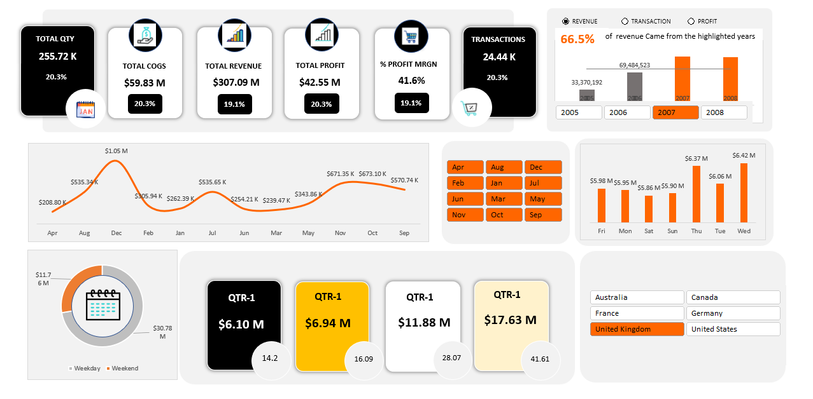

# AdventureWorks Sales Dashboard - Excel Project

## Project Overview
In this project, I created a fully interactive and dynamic sales dashboard using Microsoft Excel.  
The dashboard visualizes key metrics from the AdventureWorks dataset, providing valuable insights into company performance across different periods, categories, and countries.

This project demonstrates skills in:
- Data cleaning
- Data analysis
- Pivot tables
- Pivot charts
- Dashboard design
- KPI tracking
- Slicers and dynamic filtering
- Excel formulas (SUMIFS, VLOOKUP, etc.)
- Macros (basic automation)

## About the Dataset
The dataset contains **individual sales transaction records** for an international company.  
Each row represents a **single sales order** and includes detailed information such as:
- **Order Date**: Date when the transaction occurred.
- **Product Information**: Name and category of the sold product.
- **Sales Quantity**: Number of units sold.
- **Sales Amount**: Revenue generated from the sale.
- **Cost**: Cost of Goods Sold (COGS) for the transaction.
- **Profit**: Revenue minus cost for each sale.
- **Country/Region**: Geographic location of the customer.
- **Customer Information**: Basic customer details (limited fields).
- **Order Status**: Current status (Completed, Shipped, etc.).
- **Channel**: Whether the sale was made online or offline (if available).

The records mostly reflect **B2C (Business to Consumer)** sales transactions across various countries including the United States, United Kingdom, Canada, France, Germany, and Australia.

## Files Included
- `AdventureWorks.xlsx` - Raw dataset containing sales records.
- `moazameda3.xlsm` - Final working Excel file with fully functional dashboard and macro elements.
- `mfinalp.PNG` - Final dashboard screenshot for quick preview.

## What I Did
- Imported Raw Data: Loaded data from `AdventureWorks.xlsx` into a working sheet.
- Data Cleaning:
  - Checked for missing values and corrected inconsistencies.
  - Standardized date and currency formats.
- Data Transformation:
  - Created calculated fields like Total Cost (COGS), Total Revenue, Total Profit, and % Profit Margin.
  - Segmented data into months, quarters, and weekdays for better breakdown.
- Built Pivot Tables:
  - Created PivotTables to summarize total quantity, cost, revenue, profit, transactions, and margin.
  - Grouped and categorized the data using date fields.
- Created Pivot Charts:
  - Line chart for monthly sales trend.
  - Bar charts for year-wise revenue, weekday-wise sales, and quarterly analysis.
  - Doughnut chart for weekday vs weekend performance.
- Designed Interactive Dashboard:
  - Added KPIs at the top (Total Qty, Revenue, COGS, Profit, Margin).
  - Used Slicers to filter by Month and Country.
  - Applied Conditional Formatting for visual emphasis.
  - Created a clean and minimal UI for better readability.
- Automation with Macros:
  - Integrated minor macros for automatic refreshing of PivotTables (in `.xlsm` file).

## What the Dashboard Shows
The dashboard provides a complete overview of sales performance through several key visualizations:
- **KPI Summary Cards**:
  - Total Quantity Sold
  - Total Revenue
  - Total Cost (COGS)
  - Total Profit
  - Profit Margin
  - Total Transactions
- **Monthly Trend Line Chart**:
  - Shows monthly revenue trends to identify peak sales months.
- **Revenue Breakdown by Year**:
  - Bar chart showing how much revenue was generated each year (highlighting key years).
- **Sales Distribution Across Weekdays**:
  - Bar chart showing which weekdays had the highest sales.
- **Quarterly Revenue Performance**:
  - Breakdown of revenue across different quarters.
- **Weekend vs Weekday Sales**:
  - Doughnut chart showing sales share between weekends and weekdays.
- **Country Filter**:
  - Slicer to view sales figures based on different countries.
- **Month Filter**:
  - Slicer to filter the data and visuals by month.

This setup allows users to dynamically explore the data, spot trends, and analyze business performance from different angles.

## Key Outcomes
- Total Quantity Sold: 255.72K units
- Total COGS (Cost of Goods Sold): $59.83M
- Total Revenue: $307.09M
- Total Profit: $42.55M
- Profit Margin: 41.6%
- Total Transactions: 24.44K

### Important Insights
- The highest revenue came from the year 2007.
- Wednesday had the highest sales among weekdays.
- December showed the peak monthly sales performance.
- Majority revenue (66.5%) came from the highlighted years (2007 and 2008).
- Strong sales concentration in the United Kingdom and United States.

## Skills Demonstrated
- Data Visualization
- Data Analysis
- Data Cleaning
- PivotTables and PivotCharts
- Dashboard UI/UX Design
- Macros and Excel VBA basics
- Time-series Analysis

## Project Preview

## Conclusion
Through this project, I successfully transformed raw sales data into an insightful and professional sales dashboard.  
Key business metrics such as total revenue, cost, profit, and margins were clearly tracked and analyzed over time.  
The dashboard enabled the identification of important trends, such as peak sales periods, most profitable years, and top-performing weekdays.  

This project enhanced my skills in data analysis, dashboard creation, and business reporting using Excel, making me more proficient in presenting complex information in a simple and interactive way.
